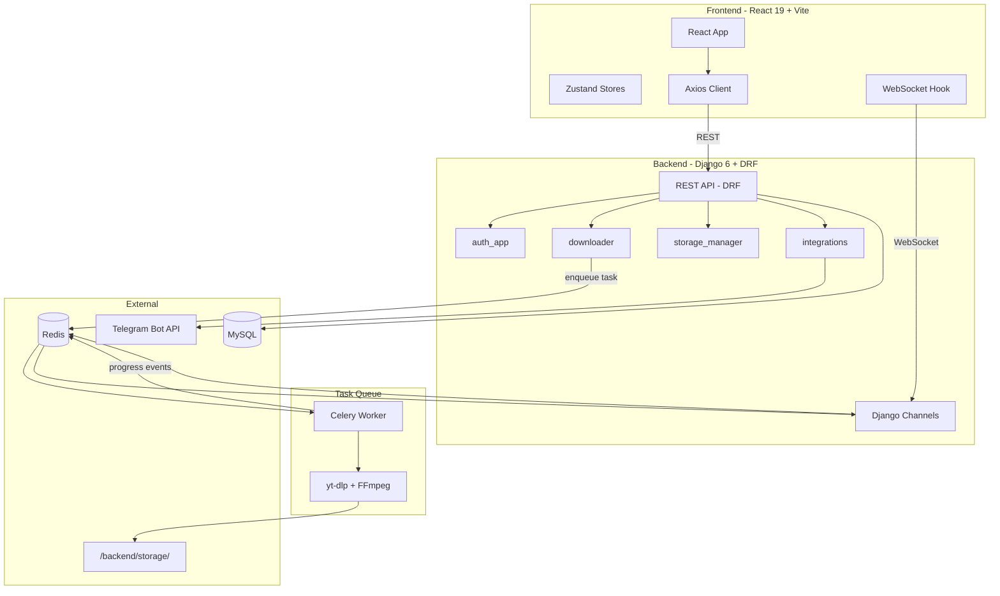

# AIO Downloader -- Full Implementation Plan

## Current State

- **Backend:** Bare Django 6 scaffold -- single `config/settings.py`, admin-only URL, no apps, no models, no requirements.txt
- **Frontend:** Vite + React 19 + Tailwind 4 + shadcn initialized (only `Button` component), no routing, no pages, default Vite template still in `App.jsx`
- **Decisions:** MySQL database, React 19 + Tailwind 4 + Django 6 (keep installed versions), rich dashboard UI built in Phase 2

---

## Phase 1 -- Foundation

### Backend

- **Split settings** into `config/settings/base.py`, `development.py`, `production.py`
  - `base.py`: SECRET_KEY from env, INSTALLED_APPS, REST_FRAMEWORK config, JWT config, CORS, CHANNEL_LAYERS, Celery settings
  - `development.py`: DEBUG=True, SQLite fallback, localhost CORS
  - `production.py`: DEBUG=False, MySQL via env, strict ALLOWED_HOSTS
- Update `manage.py`, `asgi.py`, `wsgi.py` to use `config.settings.development` by default
- **Create `requirements.txt`** with: django, djangorestframework, djangorestframework-simplejwt, django-cors-headers, channels, channels-redis, celery, redis, yt-dlp, python-telegram-bot, mysqlclient, python-dotenv, whitenoise, cryptography
- **Create 4 Django apps** under `backend/apps/`:
  - `auth_app` -- Custom User model (extends AbstractUser), serializers, register/login/refresh/me/logout views, JWT endpoints
  - `downloader` -- DownloadJob model (UUID pk, user FK, url, title, platform, status, progress, speed, eta, file_path, file_size, format, quality, error_message, sent_to_telegram, timestamps), basic CRUD views + serializers
  - `storage_manager` -- File listing/delete/stats views (no models needed, operates on filesystem + DownloadJob)
  - `integrations` -- TelegramConfig model (bot_token encrypted, chat_id, auto_send, enabled, user FK)
- **Root `.gitignore`** covering venv, __pycache__, .env, db.sqlite3, node_modules, dist, storage/*, celerybeat-schedule
- **Populate `.env.example`** files for both backend and frontend

### Frontend

- Install `react-router-dom`, `zustand`, `axios`
- **Set up routing** in `App.jsx`: `/login`, `/register`, `/dashboard`, `/history`, `/storage`, `/settings`
- **Install shadcn components:** card, input, label, select, progress, badge, table, tabs, toast, dialog, alert-dialog, sidebar, navigation-menu, switch, form, separator, dropdown-menu, textarea, avatar, sheet, tooltip
- **Layout shell:** Sidebar navigation (Dashboard, History, Storage, Settings) + top navbar with user info
- **Auth pages:** Login and Register with shadcn Card/Input/Button forms
- **Auth store** (Zustand): user, token, login(), logout()
- **Axios instance** (`src/api/client.js`): base URL from env, JWT interceptor (attach token, auto-refresh on 401)
- **PrivateRoute** guard component: redirect to `/login` if no token
- Wire up Login/Register to backend auth endpoints

### Key files to create/modify

- [backend/config/settings.py](backend/config/settings.py) -> split into `settings/` package
- [backend/apps/](backend/apps/) -- 4 new app directories
- [backend/requirements.txt](backend/requirements.txt)
- [frontend/src/App.jsx](frontend/src/App.jsx) -- replace default template with router
- [frontend/src/pages/](frontend/src/pages/) -- Login.jsx, Register.jsx
- [frontend/src/store/](frontend/src/store/) -- useAuthStore.js
- [frontend/src/api/](frontend/src/api/) -- client.js
- [frontend/src/components/layout/](frontend/src/components/layout/) -- Sidebar.jsx, Navbar.jsx, AppLayout.jsx

---

## Phase 2 -- Core Download Engine + Rich Dashboard

### Backend

- **yt-dlp wrapper** (`apps/downloader/ytdlp_utils.py`): `detect_platform()`, `probe_url()`, `build_ydl_opts()`, `run_download()`
- **Celery app config** in `config/celery.py`, imported in `config/__init__.py`
- **Celery task** `download_video_task(job_id)`: calls yt-dlp with progress hook, sends WebSocket events via channel layer, updates DB
- **Django Channels WebSocket consumer** (`apps/downloader/consumers.py`): `DownloadProgressConsumer` joining group `download_{job_id}`
- **ASGI routing** (`apps/downloader/routing.py` + `config/asgi.py`): route `ws/downloads/{job_id}/`
- **Storage folder** setup: `backend/storage/` with `.gitkeep`, output template `storage/%(extractor)s/%(title)s.%(ext)s`

### Frontend

- **Download store** (Zustand): `useDownloadStore.js` with activeJobs, addJob, updateJobProgress, removeJob
- **WebSocket hook** (`hooks/useJobWebSocket.js`): connect to `ws://host/ws/downloads/{jobId}/`, dispatch progress/done/error to store
- **Dashboard page** (`pages/Dashboard.jsx`) with rich UI:
  - **URL input bar** at top with paste button + format/quality selectors + Download button
  - **Stats row** (5 cards): URLs Fetched, Successfully Downloaded, Sent to Telegram, Failed, GB Stored -- color-coded accent stripes
  - **Charts section**: Line chart (7D/30D/All switcher for Downloaded/Sent/Failed), Platform breakdown bar chart, Storage donut chart -- using a chart library (recharts)
  - **Active downloads queue**: animated striped progress bars, speed/ETA inline, platform badge, pause/cancel/send-to-Telegram buttons per item
  - **Recent history table**: title, platform, size, status badge, Telegram sent indicator
  - **Storage breakdown**: animated per-platform bars with GB amounts
- Install `recharts` for charts

---

## Phase 3 -- Storage and History

### Backend

- **Storage manager views**: `GET /api/storage/` (list files with sizes), `GET /api/storage/stats/` (total size, count, platform breakdown), `DELETE /api/storage/{filename}/` (remove file + update job)
- Validate ownership on delete (user can only delete their own files)

### Frontend

- **History page** (`pages/History.jsx`): paginated table using `@tanstack/react-table`, columns: title, platform, size, date, status, actions (re-download, delete, send to Telegram, file info)
- **Storage page** (`pages/Storage.jsx`): file browser of storage folder, stats bar (total size, file count), bulk delete, individual delete, send to Telegram per file
- Wire delete/retry actions to backend endpoints

---

## Phase 4 -- Telegram Integration

### Backend

- **TelegramConfig CRUD views** (`apps/integrations/views.py`): GET/POST config (encrypted bot_token via Fernet), test connection endpoint, push file endpoint
- **Push logic** (`apps/integrations/telegram.py`): `send_to_telegram(job_id)` using python-telegram-bot -- `bot.send_document()` or `bot.send_video()` based on format
- **Auto-send hook** in Celery download task: after successful download, check TelegramConfig.auto_send -> push if true
- File size warning: return error/warning if file > 50MB (Bot API limit)

### Frontend

- **Settings page** (`pages/Settings.jsx`):
  - Telegram section: bot token input (masked), chat ID input, auto-send toggle, test connection button, save button
  - Account section: change password, display name
  - Preferences section: default format, default quality
- "Send to Telegram" buttons on Dashboard, History, and Storage pages wired to push endpoint

---

## Phase 5 -- Polish and Production

### Backend

- **Playlist support**: detect YouTube playlists, spawn one DownloadJob per video in the playlist
- **Error handling**: DRF custom exception handler returning structured `{error, detail, code}`, Celery task auto-retry (max 3, exponential backoff)
- **Production settings**: MySQL config from DATABASE_URL env, STATIC_ROOT + whitenoise, HTTPS-related settings
- **Rate limiting** on auth endpoints

### Frontend

- **Toast notifications** throughout: download started, completed, error, Telegram sent
- **Dark mode** support (Tailwind dark: classes, theme toggle in navbar)
- **WebSocket auto-reconnect** with exponential backoff (max 5 attempts)
- **Axios 401 interceptor** with token refresh or redirect to login

### Repository

- **Root `.gitignore`** finalized
- **Postman collection** (`postman/collection.json` + `environment.json`) covering all endpoints
- **`.env.example`** files fully documented
- Create `backend/storage/` directory with `.gitkeep`

---

## Architecture Diagram

