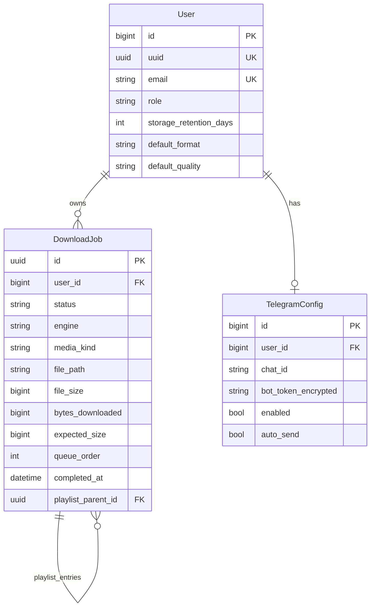

# Entity relationship overview

Conceptual ERD for the main domain objects. This is documentation only; see Django migrations for the source of truth.

## Notes

- `DownloadJob.id` is a UUID primary key; `User.id` is the default bigint from `AbstractUser`.
- `User.uuid` is the folder name under `MEDIA_ROOT` for that user’s files.
- `DownloadJob.engine` is `ytdlp` or `http`; HTTP jobs use extra progress/resume fields (`bytes_downloaded`, `expected_size`, etc.).
- `User.role` is `owner` or `admin` (default `admin`; seeded dev user and Django superusers are `owner`).
- Telegram **bot token** is stored encrypted on the **owner’s** `TelegramConfig` row and used for all Bot API calls. Each user’s row holds their **receiver** (`chat_id`), plus `enabled` and `auto_send`.
