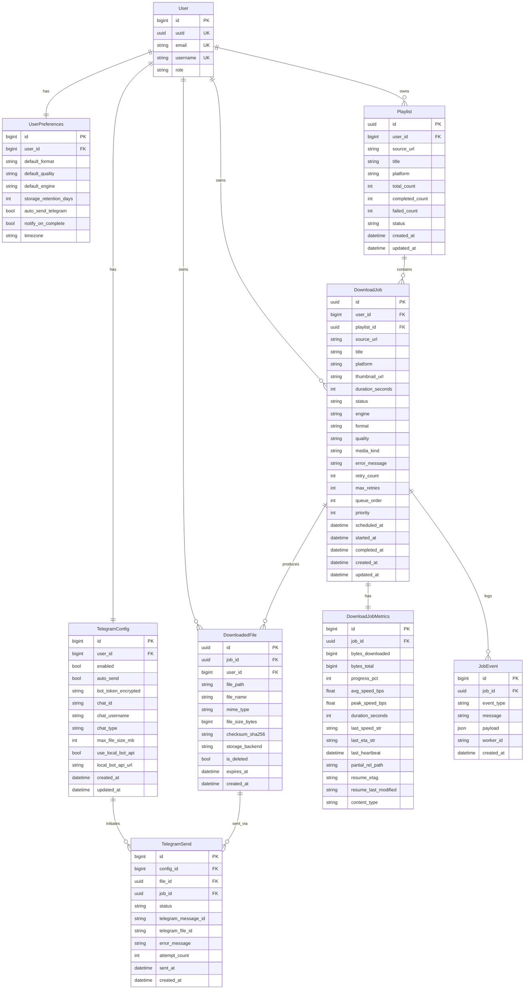

# Entity relationship overview

Conceptual ERD for the main domain objects. This is documentation only; see Django migrations for the source of truth.

## Notes

- `User.uuid` is the folder name under `MEDIA_ROOT` for that user’s files.
- `DownloadJob.engine` is a free-form string (e.g. `yt-dlp`, `http`); classification sets it at create time.
- `DownloadJob.platform` is free text (from yt-dlp / URL hints), not a fixed enum.
- `User.role` is `owner` or `admin` (default `admin`; seeded dev user and Django superusers are `owner`).
- Telegram **bot token** is stored encrypted on the **owner’s** `TelegramConfig` row and used for all Bot API calls. Each user’s row holds receiver settings (`chat_id`, etc.), `enabled`, and optional local Bot API URL. **Auto-send** for completed downloads is driven by `UserPreferences.auto_send_telegram` plus `TelegramConfig.enabled` and a valid `chat_id`.
- `DownloadedFile.expires_at` is set from `UserPreferences.storage_retention_days` when a file is created; `cleanup_expired_download_files` deletes expired files and marks rows `is_deleted`.
- REST exposes backward-compatible aliases on jobs (`url`, `progress`, `speed`, `file_size`, `sent_to_telegram`, `playlist_parent`) alongside nested `metrics` and `files`.
