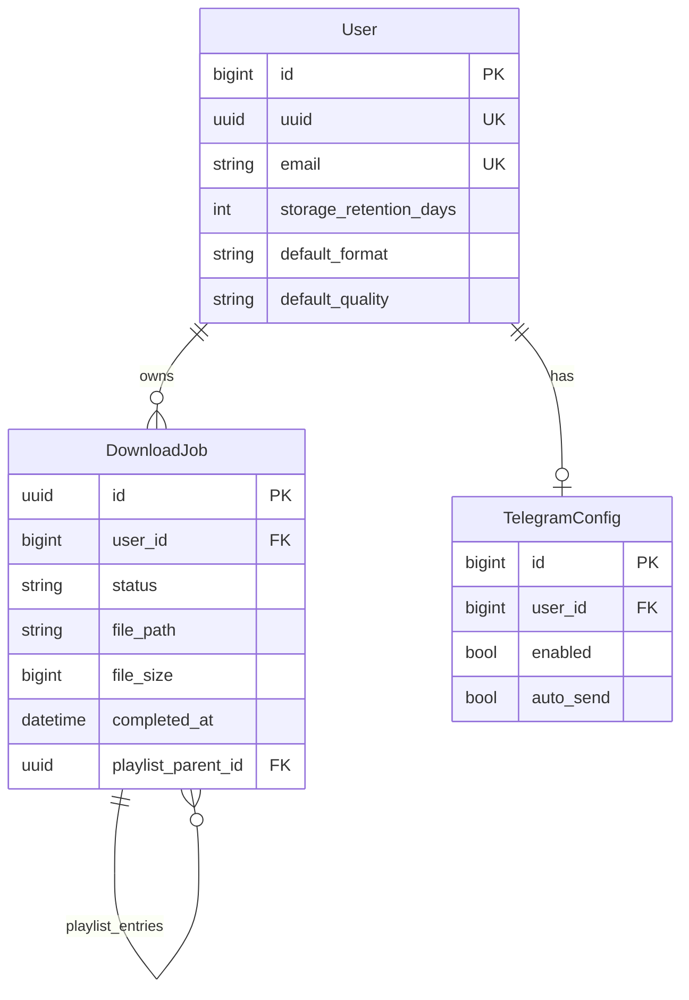

# Entity relationship overview

Conceptual ERD for the main domain objects. This is documentation only; see Django migrations for the source of truth.

## Notes

- `DownloadJob.id` is a UUID primary key; `User.id` is the default bigint from `AbstractUser`.
- `User.uuid` is the folder name under `MEDIA_ROOT` for that user’s files.
- Telegram tokens are stored encrypted; see `apps.integrations`.
